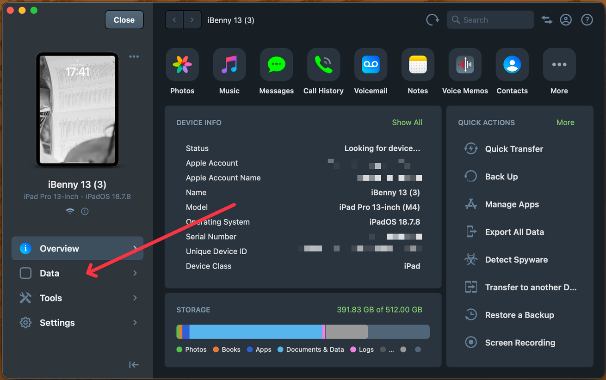
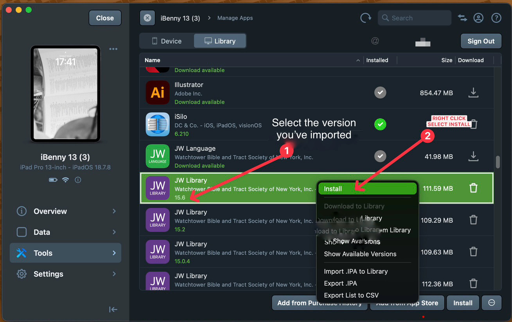

# How to install custom JWPUB archives on an iPhone or iPad using your Mac (without Jailbreak)

**Difficulty:** Intermediate — some experience with using Terminal and command-line commands is helpful.

Once the custom `.jwpub` files are installed, JW Library can be updated to the latest version, while the custom files remain in the app. We will use two tools — ipatool and iMazing.

| Tool | Purpose |
|---|---|
| ipatool | Downloads the older version of JW Library |
| iMazing | Installs it on your iPhone or iPad |

Currently, the free (trial) version of iMazing does not allow you to download older versions of apps, which is why we need a second tool. Since ipatool is a command-line tool, you can simply open your Mac's Terminal app and copy and paste the commands provided in this guide.

## What you need

- A Mac
- An iPhone or iPad
- A USB cable
- An Apple Account
- An internet connection

> ⚠️ **IMPORTANT:** Before proceeding, make sure to make a backup of your JW Library, including your notes, highlights and playlists. Even if the method described in this guide does not work for you, your backup will keep your data safe.

> 📌 **PLEASE NOTE:** The archived .ipa file obtained through this process is downloaded from the official App Store and is tied to your personal Apple Account. Therefore, it cannot be shared with other people. Each person needs to obtain their own copy.

## 1. Preliminary steps

Search for and open Terminal on your Mac.

First, install Homebrew, which will allow us to install the other programs needed for this process.

Inside Terminal, run the following command:

```bash
if command -v brew >/dev/null 2>&1; then
  echo "Homebrew is already installed — skipping Homebrew installation."
else
  /bin/bash -c "$(curl -fsSL https://raw.githubusercontent.com/Homebrew/install/HEAD/install.sh)"
fi
```

If Homebrew is already installed, you'll see a message saying so and can continue. Otherwise, Homebrew will be installed on your Mac — this may take a while, and the installation may ask for your password. Enter your Mac password when prompted.

## 2. Install ipatool and iMazing

After Homebrew has been successfully installed, copy and paste both commands at once:

```bash
brew install ipatool
brew install --cask imazing
```

Wait for both programs to finish installing.

## 3. Log in to ipatool

Inside Terminal, run:

```bash
ipatool auth login
```

Follow the instructions to sign in with your Apple Account.

> 📌 **PLEASE NOTE:** Don't worry about entering your Apple Account password directly into Terminal. ipatool communicates with Apple's servers to authenticate your account, and Apple will require two-factor authentication as part of the sign-in process.

## 4. Download JW Library version 15.6

You can now download the archived version of JW Library.

**For an iPhone** inside Terminal, run:

```bash
ipatool download --app-id 672417831 --external-version-id 878901217 --platform iphone --output ~/Downloads/JWLibrary-15.6.ipa --purchase
```

**For an iPad** inside Terminal, run:

```bash
ipatool download --app-id 672417831 --external-version-id 878901217 --platform ipad --output ~/Downloads/JWLibrary-15.6.ipa --purchase
```

The .ipa file will be saved in your Mac's Downloads folder.

## 5. Connect your iPhone or iPad to iMazing

Connect your device to your Mac using a USB cable. Unlock your device and, if prompted, choose Trust and follow the instructions on the screen.

Open iMazing from Launchpad. When you first open it, choose Trial Mode.

Select your connected iPhone or iPad, then go to:

**Tools → Manage Apps** (see img below)

At the top of the Manage Apps window, select the **Library** tab — not **Device**. You should see your currently installed JW Library there.



## 6. Import JW Library 15.6 into iMazing's Library

Open your Mac's Downloads folder and find `JWLibrary-15.6.ipa`, then drag the file into the Library section of iMazing.

You'll be prompted again for your Apple Account password.

If you had JW Library before, you'll see two entries — your existing JW Library and the newly imported 15.6 version. If you're installing from scratch, you'll just see the one import.

This confirms the import worked before you touch your original app — if it fails here, your currently installed JW Library is untouched.

## 7. Delete the existing JW Library app

> ⚠️ **IMPORTANT:** Make sure you have successfully completed the backup described at the beginning of this guide before continuing.

Once you have confirmed that your backup is safe and that you have successfully imported the archived IPA file into iMazing, delete the currently installed JW Library app from your device. You can do this directly from your iPhone or iPad while it remains connected to your Mac by cable.

**Note:** After you delete JW Library from your iPhone or iPad, the old JW Library entry may still appear in iMazing's Library tab. This is normal — that entry is simply the copy that iMazing has stored in its library, and deleting the app from your device does not necessarily remove the copy from the iMazing Library.

## 8. Install JW Library 15.6

Right-click the newly imported JW Library 15.6 entry and select **Install** (see img below). iMazing will ask you to confirm your Apple Account password — wait for the installation to finish.

You can now delete the original JWLibrary-15.6.ipa file from your Downloads folder. Keep the copy in iMazing's Library.

> 💡 **Future installations:** Once JW Library 15.6 is stored in iMazing's Library, you do not need to download the IPA again. If you need to downgrade to version 15.6 again in the future, it's easy: simply open **iMazing → Manage Apps → Library**, select the stored JW Library 15.6, and click **Install**.



## 9. Open JW Library

Open JW Library on your iPhone or iPad — you should now be running version 15.6.

## 10. Install custom JWPUB files

You can install your custom JWPUB files manually. However, to save time, you can use iMazing's Quick Transfer tool, which allows you to transfer multiple .jwpub files at the same time.

- In iMazing, select your iPhone or iPad.
- Go to **Tools → Quick Transfer**.
- Select all the custom JWPUB files you want to install.

> 💡 **Tip:** Quick Transfer can also be used to install larger JWPUB files, such as the Bible or the Insight book. First, download the files to your computer from the JW.org website, then use Quick Transfer to import all of them to your device in one go. You may need to restart JW Library for the imported files to appear.

## ✅ Done

Once you have installed everything you need, you can safely update JW Library to the latest version — your custom JWPUB files will remain in place after the update.

At this point, you can restore your saved backup and download your official Bibles, publications, videos, etc.
